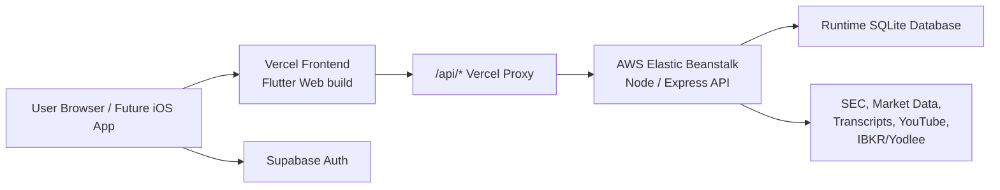

# Guru Intelligence

A buy-side research terminal for guru portfolios, managed futures exposure,
fundamental valuation, and private portfolio management.

Guru Intelligence combines public filings, market data, earnings-call Q&A,
podcast commentary, valuation models, and user-linked portfolio data into one
dark terminal experience for research and monitoring.

## What It Does

| Module | Purpose | Highlights |
| --- | --- | --- |
| Guru | Track 13F funds, Form 4 insiders, and public trading signals | Guru profiles, AI-style avatars, portfolio-vs-SPY simulation, new buys/sells, quarterly contribution, signal board, crowded-holding heatmap |
| DBMF | Monitor managed-futures exposure | Official DBMF exposure book, direction tags, prior-period markers, exposure bars, refreshable backend data |
| Valuation | Research fair value and price history | Fair-value matrix, ticker search, historical valuation curve, daily price overlay, quarterly model book, model weights, call-transcript Q&A, podcast-derived forward insights |
| Portfolio | Manage private brokerage portfolios | IBKR/Yodlee connection flow, multi-account sync, NAV history, holdings, logo-backed allocation, valuation gap, dividend calendar, portfolio analytics |
| Admin | Operate and audit the system | Admin-only portfolio user list, account detail drilldown, backend health, backtest refresh controls |

## Product Shape

The product is intentionally built like an internal investment terminal:

- dense but scan-friendly panels;
- dark navy workspace with mint active states and amber benchmark context;
- persistent top-level modes: `Guru`, `DBMF`, `Valuation`, `Portfolio`, and admin-only `Admin`;
- responsive web UI today, with an iPhone-first App Store path in progress.

## Architecture



The deployment contract is deliberately strict:

- Vercel owns the public frontend.
- AWS Elastic Beanstalk owns the API backend.
- `www.thesisforge.tech` must resolve to Vercel.
- `/api/*` is proxied from Vercel to AWS.
- Runtime data stays on the backend and is not committed to Git.

Read [docs/deployment-contract.md](docs/deployment-contract.md) before changing
DNS, Vercel, AWS, CI, or API routing.

## Local Development

Requirements:

- Flutter SDK
- Node.js and npm
- local environment variables based on `.env.example`

```bash
npm install
flutter pub get
npm run dev
```

Default local services:

| Service | URL |
| --- | --- |
| Flutter web client | `http://127.0.0.1:5174` |
| Express API | `http://127.0.0.1:8787` |

Local development uses `API_AUTH_DEV_BYPASS=true` for the backend and sends a
local development bearer token from the client. Production must use Supabase
auth and must not ship dev bypass settings.

## Useful Commands

```bash
# Web build for Vercel
npm run build

# Backend package for AWS Elastic Beanstalk
npm run package:aws

# Hydrate local/runtime database
npm run hydrate:db

# Install or refresh guru avatars
npm run install:avatars

# Refresh dividend calendar data
npm run refresh:dividends

# Import valuation aliases and derived valuation tickers
npm run import:valuation-aliases
npm run import:derived-valuations

# Build App Store archive once paid Apple Developer signing is available
scripts/build-ios-appstore.sh
```

## Backend API Surface

Representative API routes:

| Route | Description |
| --- | --- |
| `GET /api/health` | API and database health |
| `GET /api/gurus` | Guru dashboard payload |
| `GET /api/gurus/:id/backtest` | Portfolio-vs-SPY simulation |
| `GET /api/gurus/:id/context` | Ticker context for selected guru activity |
| `GET /api/dbmf` | DBMF exposure dashboard |
| `GET /api/valuation` | Fair-value matrix |
| `GET /api/valuation/:ticker` | Ticker detail, history, model book, Q&A, commentary |
| `GET /api/portfolio` | User portfolio cockpit |
| `POST /api/portfolio/sync` | Fetch and store linked portfolio data |
| `POST /api/portfolio/dividends/refresh` | Refresh dividend data for portfolio names |
| `GET /api/admin/portfolio-users` | Admin-only user overview |
| `GET /api/admin/system-health` | Admin-only backend health |

Protected routes require Supabase-authenticated requests in production.

## Data And Research Pipelines

The backend includes import and enrichment jobs for:

- SEC and 13F-style guru holdings;
- Form 4 and public-stock activity;
- market price and logo enrichment;
- valuation model history and ticker aliases;
- earnings transcript Q&A extraction and Chinese translation;
- YouTube and podcast transcript nowcasts;
- dividend calendar normalization, including GBp/GBX-to-GBP handling;
- portfolio NAV and holdings snapshots from linked brokerage reports.

Most jobs are intentionally run from scripts or backend cron-style endpoints
instead of the frontend. User secrets and brokerage credentials must stay
encrypted on the backend.

## Security Notes

- Supabase service-role keys must never be shipped to the browser or iOS app.
- IBKR/Yodlee connection credentials are user-specific and backend-only.
- Portfolio data is scoped by authenticated user identity.
- Admin routes are restricted to configured admin emails.
- Account deletion is implemented through `DELETE /api/account` and removes
user-owned portfolio data before attempting Supabase Auth deletion.

## iOS / App Store Path

This repo now includes a Flutter iOS shell under `ios/`.

Current iOS facts:

- App name: `Guru Intelligence`
- Bundle ID: `tech.thesisforge.guru`
- Native callback scheme: `guru-intelligence://auth/callback`
- App icon and launch image assets are generated.
- Sign in with Apple and in-app account deletion are implemented.
- `flutter build ipa --no-codesign` succeeds locally.

Current blocker:

- TestFlight and App Store upload require an active paid Apple Developer Program
  team. A Personal Team can create development certificates, but it cannot
  upload App Store builds.

Read:

- [docs/ios-app-store-readiness.md](docs/ios-app-store-readiness.md)
- [docs/ios-implementation-roadmap.md](docs/ios-implementation-roadmap.md)
- [docs/ios-product-design-brief.md](docs/ios-product-design-brief.md)
- [docs/ios-asset-inventory.md](docs/ios-asset-inventory.md)

## Deployment

Frontend deployment:

```bash
git push origin HEAD:trunk
```

Vercel builds the frontend with:

```bash
bash scripts/vercel-install.sh
bash scripts/vercel-build.sh
```

Backend deployment:

```bash
bash scripts/package-aws-backend.sh <version>
```

Do not package Flutter `dist/` into AWS unless Vercel is unavailable and the
emergency fallback is explicitly requested.

## Repository Map

| Path | Purpose |
| --- | --- |
| `lib/main.dart` | Flutter application and current terminal UI |
| `server/` | Express API, import jobs, market/valuation/portfolio clients |
| `api/proxy.js` | Vercel API proxy to AWS |
| `scripts/` | Build, deploy, import, and App Store helper scripts |
| `docs/` | Deployment, iOS, audit, and product-readiness documentation |
| `web/guru-avatars/` | Public guru avatar assets |
| `ios/` | Flutter iOS platform shell |
| `prototypes/ios-guru-app-design/` | Product-design prototype for the iPhone app |
| `microsoft-copilot-nowcast/` | Separate experimental nowcast implementation |

## Microsoft Copilot Earnings Nowcast

An isolated Python/FastAPI implementation lives in
`microsoft-copilot-nowcast/`. It is intentionally separate from the main Guru
Intelligence Flutter/Node deployment contract.

```bash
cd microsoft-copilot-nowcast
make install
make seed
make api
```

See [microsoft-copilot-nowcast/README.md](microsoft-copilot-nowcast/README.md)
for that subproject.

## Status

Guru Intelligence is an active private product build. The web terminal is the
current production surface. The iOS app is prepared at the project level and is
waiting on paid Apple Developer Program signing before TestFlight upload.
