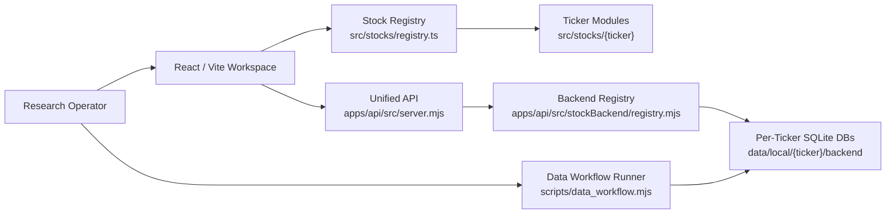
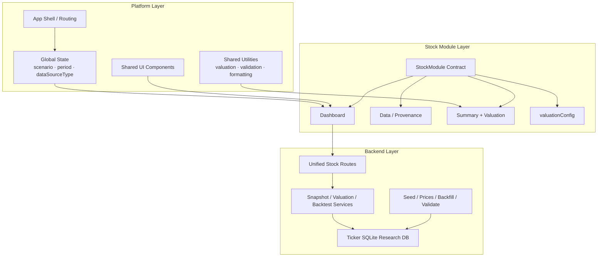
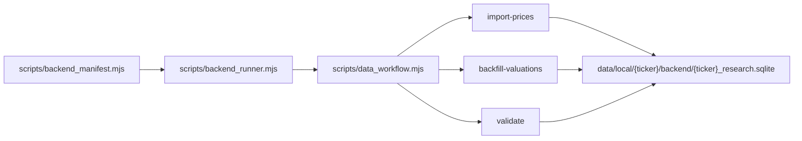
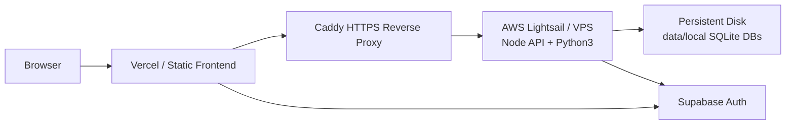

# Fundamental Analysis

> A plugin-based buy-side fundamental research platform for company dashboards, valuation work, source quality review, and local backend data operations.

[](.github/workflows/quality.yml)
[](package.json)
[](apps/api/src/server.mjs)
[](docs/platform_operations_guide.md)

## Overview

Fundamental Analysis is a modular public-equity research workspace. It is designed as a **platform**, not a set of one-off stock pages: each company is a registered stock module with its own business logic, model, dashboard, and data provenance, while the app shares one shell, one registry, one contract, and one backend workflow surface.

The repository now includes:

- 27 registered stock modules
- a unified frontend stock registry
- a unified Node API backend
- per-ticker local SQLite research databases
- historical valuation and backtest workflows for backend-backed modules
- operator commands for data refresh, validation, price imports, and valuation backfills
- production deployment notes for Vercel frontend + VPS/Lightsail backend

## Product Surface



## Why This Exists

Buy-side research systems tend to drift into disconnected notebooks, bespoke dashboards, and fragile spreadsheet workflows. This platform keeps company-specific analytical depth while standardizing the mechanics that should be shared:

- stock registration
- valuation output shape
- assumption state handling
- data quality and warning semantics
- backend route structure
- local database lifecycle
- operator update commands

The result is a workspace where new stock modules can be added without creating standalone pages, and existing modules can gradually migrate toward shared platform standards.

## Architecture



## Stock Module Contract

Every registered stock module is expected to preserve the platform contract defined in [`src/stocks/types.ts`](src/stocks/types.ts):

| Contract field | Purpose |
| --- | --- |
| `data` | Module dataset, assumptions, source tags, and fallback state |
| `calculateSummary` | Standard summary cards and operating metrics |
| `calculateValuation` | Unified valuation output shape |
| `Dashboard` | Ticker-specific research UI |
| `valuationConfig` | Shared valuation UI wiring |

The registry is the frontend source of truth:

- [`src/stocks/registry.ts`](src/stocks/registry.ts)
- [`src/stocks/moduleAssembly.ts`](src/stocks/moduleAssembly.ts)
- [`src/stocks/metadata.ts`](src/stocks/metadata.ts)

## Registered Research Coverage

The platform currently includes modules across payments, software, semis, mega-cap tech, pharma, defense, exchanges, consumer, and industrials.

| Area | Modules |
| --- | --- |
| Payments / Networks | `MA`, `V` |
| Software / AI / Data Platforms | `MSFT`, `NOW`, `PLTR`, `GOOGL`, `META` |
| Semiconductors / AI Infrastructure | `ASML`, `NVDA`, `TSM`, `ANET` |
| Exchanges / Data / Market Infrastructure | `LSEG`, `TRI` |
| Healthcare / Biopharma / Tools | `MCK`, `ISRG`, `AZN`, `GILD`, `BMY`, `LEGN` |
| Defense / Aerospace | `BA`, `NOC`, `RTX`, `LMT` |
| Consumer / Other | `AAPL`, `AMZN`, `DGE` |

Run the contract check:

```bash
npm run stocks:contract:validate
```

## Backend Strategy

The current backend strategy is **Option B**:

> Keep per-ticker SQLite databases, but operate them through a shared backend framework.

This avoids a risky forced migration into one giant database while still giving the operator a unified command surface.



Core backend files:

- [`apps/api/src/server.mjs`](apps/api/src/server.mjs)
- [`apps/api/src/routes/stockBackend.mjs`](apps/api/src/routes/stockBackend.mjs)
- [`apps/api/src/stockBackend/registry.mjs`](apps/api/src/stockBackend/registry.mjs)
- [`scripts/backend_manifest.mjs`](scripts/backend_manifest.mjs)
- [`scripts/backend_runner.mjs`](scripts/backend_runner.mjs)
- [`scripts/data_workflow.mjs`](scripts/data_workflow.mjs)

## Operator Commands

Install and run locally:

```bash
npm install
npm run dev
```

Run the backend locally:

```bash
npm run api:dev
```

Production API start command:

```bash
npm run api:start
```

Quality checks:

```bash
npm run typecheck
npm run stocks:contract:validate
npm run build
```

Data workflows:

```bash
npm run data:backend:list
npm run data:update
npm run data:validate
npm run data:prices
npm run data:backfill
```

One-ticker workflows:

```bash
npm run data:update:ticker -- --ticker ma
npm run data:validate:ticker -- --ticker lseg
npm run data:prices:ticker -- --ticker v
npm run data:backfill:ticker -- --ticker msft
```

Source audit:

```bash
npm run data:audit:sources
npm run data:freshness
```

## Data Update Semantics

`npm run data:update` intentionally runs the safe default workflow:

```text
import-prices -> backfill-valuations -> validate
```

It does **not** automatically run:

- official source fetches
- transcript fetches
- seed resets
- metric builders
- dataset builders

Those flows remain ticker-specific unless they have been standardized and proven safe.

## Deployment Model

The recommended production setup is a split deployment:



Frontend production variables:

```bash
VITE_AUTH_PROVIDER=supabase
VITE_SUPABASE_URL=https://your-project.supabase.co
VITE_SUPABASE_ANON_KEY=your-production-supabase-anon-key
VITE_API_BASE_URL=https://api.your-domain.com
VITE_AUTH_DEV_BYPASS=false
```

Backend production variables:

```bash
NODE_ENV=production
PORT=8787
API_HOST=127.0.0.1
SUPABASE_URL=https://your-project.supabase.co
SUPABASE_JWT_SECRET=your-production-supabase-jwt-secret
API_ALLOWED_ORIGINS=https://your-frontend-domain.com
API_AUTH_DEV_BYPASS=false
```

Validate production env:

```bash
npm run env:validate:production
```

Deployment notes:

- [`docs/cloud_backend_deployment.md`](docs/cloud_backend_deployment.md)
- [`docs/data_operator_runbook.md`](docs/data_operator_runbook.md)
- [`docs/platform_operations_guide.md`](docs/platform_operations_guide.md)

## Repository Map

| Path | Role |
| --- | --- |
| [`src/routes`](src/routes) | App routes and stock dashboard loader |
| [`src/components/layout`](src/components/layout) | Shared shell, navigation, stock selector |
| [`src/components/shared`](src/components/shared) | Shared panels, cards, badges, valuation UI |
| [`src/stocks`](src/stocks) | Registered stock modules |
| [`src/utils`](src/utils) | Shared math, valuation, validation, formatting |
| [`apps/api/src`](apps/api/src) | Unified backend API |
| [`modules`](modules) | Per-ticker backend schema, seed, ingestion, market, valuation adapters |
| [`scripts`](scripts) | Operator workflows, validation, data refresh commands |
| [`docs`](docs) | Platform, backend, deployment, and module template docs |
| `data/local` | Local research data and SQLite DBs, intentionally not committed |

## Adding A New Stock Module

Use the documented module template flow:

- [`docs/new_stock_module_template.md`](docs/new_stock_module_template.md)
- [`docs/new_stock_module_execution_prompt.md`](docs/new_stock_module_execution_prompt.md)
- [`docs/new_stock_acceptance_checklist.md`](docs/new_stock_acceptance_checklist.md)

At a minimum:

1. Create `src/stocks/{ticker}`.
2. Implement the stock module contract.
3. Register the module in `src/stocks/registry.ts`.
4. Keep business-specific logic inside the ticker folder.
5. Use shared assembly, valuation state, and validation helpers where they fit.
6. Run `npm run stocks:contract:validate`.
7. Run `npm run build`.

## Quality Gates

The repository includes a lightweight GitHub Actions workflow at:

- [`.github/workflows/quality.yml`](.github/workflows/quality.yml)

Recommended local pre-push checks:

```bash
npm run typecheck
npm run stocks:contract:validate
npm run build
```

Current known caveat:

- the production build succeeds, but the stock dashboard chunk is large and should be reduced with further route/module-level code splitting.

## Data And Source Policy

This repository separates code from local research data:

- code, schemas, docs, scripts, and source-backed static model files belong in Git
- local SQLite DBs and bulky raw downloaded files belong in `data/local`
- production secrets belong in platform environment variables, not in Git

`data/local` is intentionally ignored. For cloud deployment, copy it separately to the backend host with a tool such as `rsync`.

## Status

The platform has moved from a small multi-stock frontend into a backend-aware research system with standardized operator workflows. The next major hardening areas are:

- bundle splitting
- deeper runtime test coverage
- stronger source freshness metadata
- gradual migration of remaining ticker-specific fetch/transcript flows into the shared backend workflow
