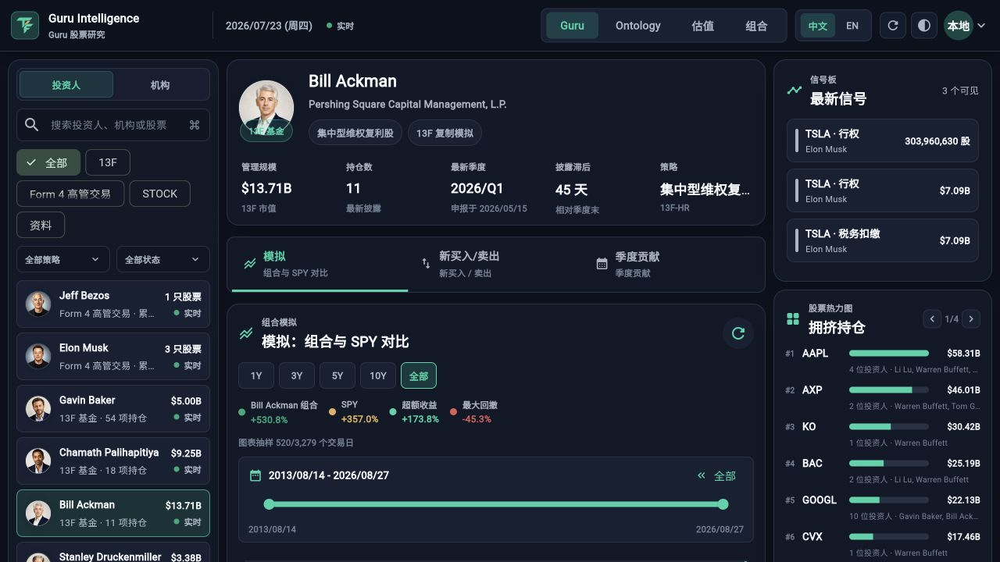
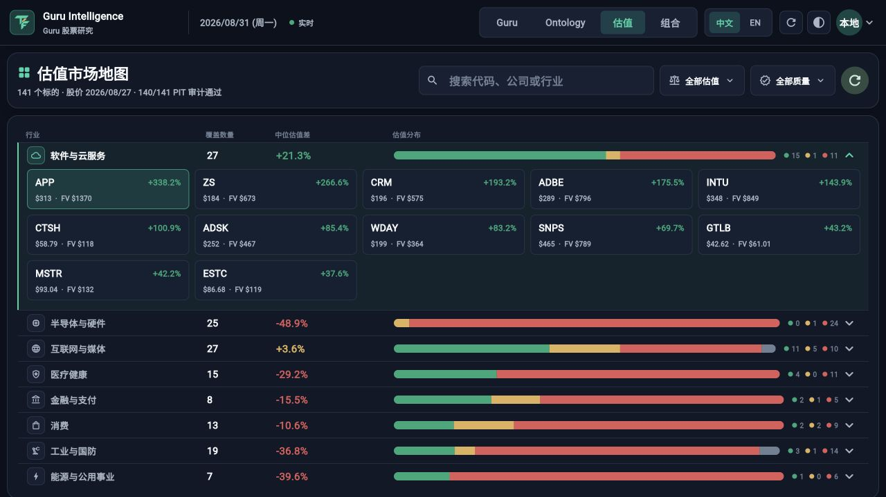
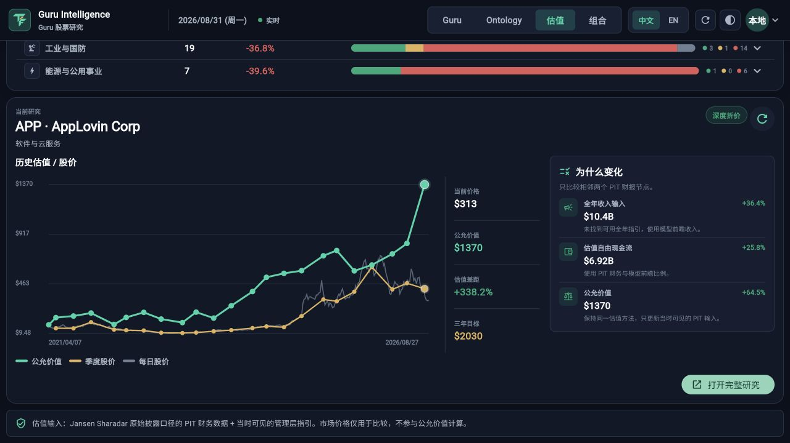
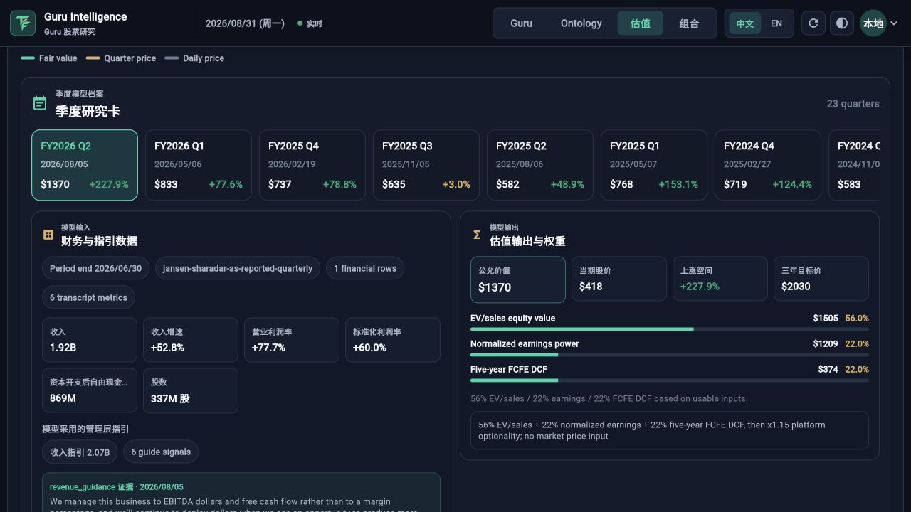
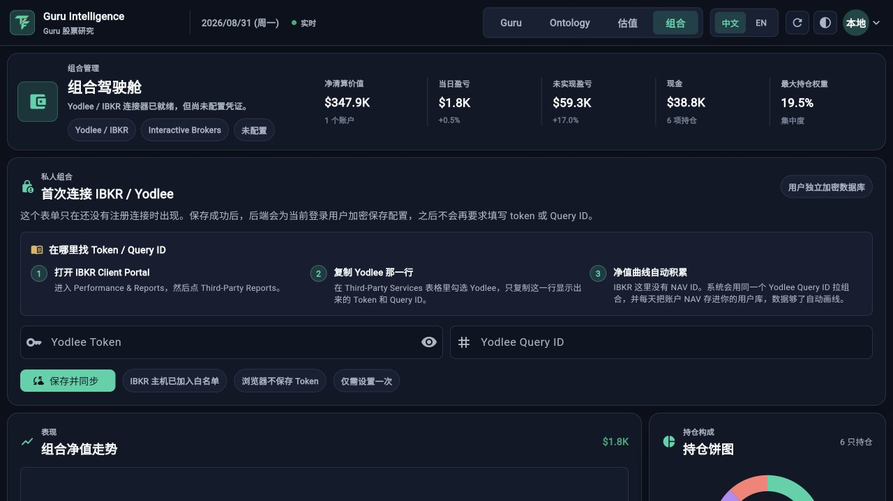
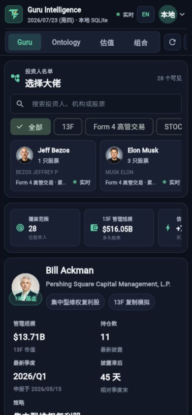
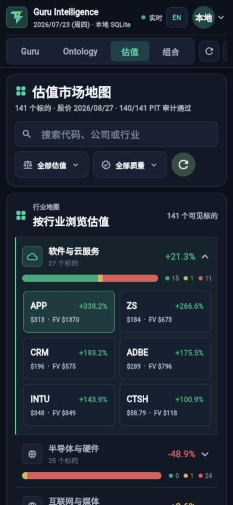
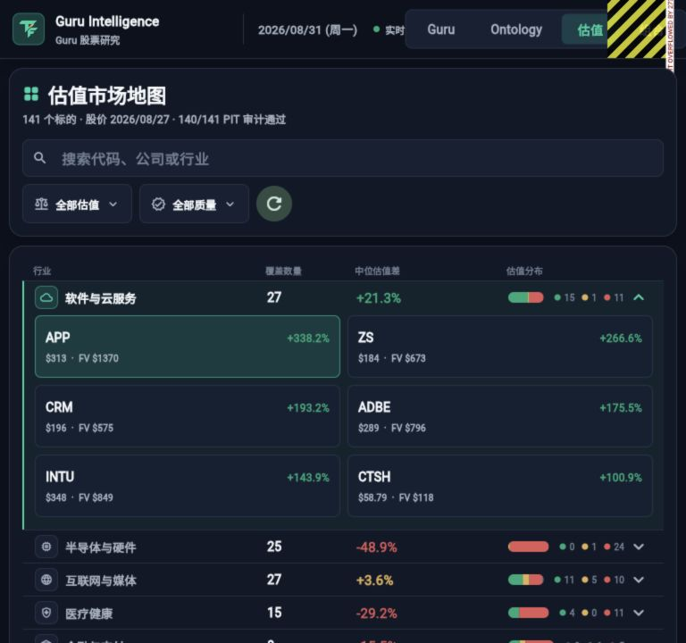
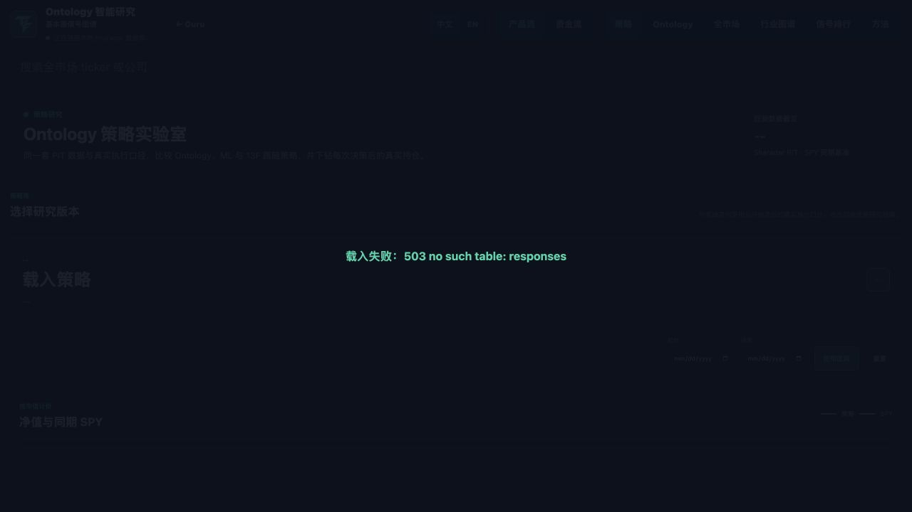

# ThesisForge / Guru Intelligence 产品审计

审计日期：2026-08-31
审计视角：资深产品经理 + 专业金融终端用户 + 模型审计
代码版本：`fdda133`（审计时工作区包含用户未提交变更，本次未修改产品代码）

## 1. 结论

当前产品已经不是普通“股票 dashboard”。它最有价值的资产是 Valuation：PIT 数据谱系、逐季度输入、管理层指引证据、方法权重和公式能在一个界面内被追踪。视觉语言、移动端 390px 布局、本地 API 传输优化和中英双语也已达到可收费 beta 的基础。

但它还不能作为机构级“可信终端”交付。最大缺口不是功能数量，而是 **状态真相、方法口径和错误恢复**：界面可能把缓存/样本/轻量检查表现成 live、真实组合或 PIT audited；Guru 回测存在足以影响 headline return 的执行与再平衡口径问题；Ontology 在依赖缺失时全屏失败且无恢复；Portfolio 将样本数字呈现得过于像真实账户。

**当前定位：64/100，可作为高级个人投资者/独立研究员的付费研究 beta；不应宣传为 Bloomberg/FactSet 替代品，也不应让机构用户直接依赖 Guru 回测或 Portfolio 数字做投资/合规决策。**

建议目标：12 周内达到 **82/100 的“可信专业个人投资终端”**，先把所有状态、来源、时间和方法变成不可误读的真相层，再补机构工作流。

## 2. 评分

| 维度 | 当前分 | 目标分 | 判断 |
| --- | ---: | ---: | --- |
| 可用性 | 63/100 | 85 | 桌面和手机主流程可完成；768px 顶部导航溢出，跨模块历史、错误恢复和假控件拖累明显 |
| 易用性 | 66/100 | 82 | 信息密度高但视觉层级尚可；默认标的、筛选语义、刷新反馈和跨模块上下文增加认知成本 |
| 专业价值 | 68/100 | 88 | Valuation 证据链显著领先；Guru 回测、审计徽章含义和样本外验证尚未达到专业终端标准 |
| 可靠性/运营成熟度 | 53/100 | 80 | 本地组件测试和性能强；生产可观测性、健康检查、数据新鲜度和发布门禁仍不足 |
| **综合** | **64/100** | **82** | **付费 beta，尚非机构可信终端** |

模块判断：Valuation 是旗舰资产；Guru 是获客入口但方法风险最高；Ontology 有差异化但产品化和恢复能力不足；Portfolio 当前更像受控演示而非可托管真实资金数据的模块。

## 3. 真实流程审计

### 3.1 Guru 首页与回测 — ⚠️ 可用，但不能把结果当机构级业绩

优点：投资人、披露类型、最新季度、披露滞后、回测、交易和季度贡献集中在一个工作区；主视图能快速产生研究问题。

关键问题：

1. `AUM` 实际是 13F 表内申报价值，不包含现金、空头、非申报资产，并可能混入 put/call 的名义价值，不应称基金 AUM。
2. 回测仅保留 `filingDate`，并以当日收盘作为执行日；若文件收盘后才被 SEC 接收，会产生前视。
3. 主净值按日把组合拉回披露权重，而季度贡献近似买入持有，两处并非同一组合引擎，headline return 与归因不能相互核对。
4. 图上未就地展示 execution rule、总回报/价格回报、交易成本、缺失证券覆盖率、delisting 和 amendment 口径。
5. 本地 `/api/gurus` 的 `generatedAt` 为 2026-07-23，但 2026-08-31 顶部仍显示绿色“实时”；全局头部还会在其他模块复用 Guru 的来源与日期。

### 3.2 Valuation 市场地图 — ✅ 最接近专业终端的入口

优点：行业分布、估值差、质量筛选、当前价格与公允价值在一个任务面中；141 个标的、价格日期和审计覆盖可见；初始摘要/完整研究两阶段加载降低首屏成本。

关键问题：

1. `Undervalued` 的筛选阈值与行业分布阈值不一致；同屏可产生不同“便宜”含义。
2. 搜索零匹配时，下方可能继续显示上一个 ticker 的研究，存在错标的决策风险。
3. 默认自动选择 upside 最大标的，容易把最极端模型输出当成默认推荐；应使用稳定 featured 标的或要求用户明确选择。
4. 顶部 `PIT audited` 优先取轻量 input audit，而非完整 release verifier；它证明不了经济模型有效或未来收益可预测。

### 3.3 Valuation 详情与模型解释 — ✅ 核心竞争力

优点：历史 fair value、价格、变化原因、逐季度研究卡、财务与指引输入、来源类型、方法输出、权重和公式能串成审计链。这是产品最值得保留和放大的部分。

关键问题：

1. PIT release gate 主要证明数据谱系、时间边界、算术和确定性，不等于估值有预测力；界面需要把“lineage pass”“model validation”“market calibration”分成三个徽章。
2. 历史节点是 data-PIT，但使用当前版本模型回放，不是当时版本模型；应明确标注 `current-model retrospective replay`。
3. 缺少 walk-forward 样本外验证：不同年份/行业的 12/36 个月超额收益单调性、误差区间、覆盖率和模型漂移。
4. 3Y target 本质上是机械情景复利，应叫 scenario，而不是容易被理解为分析师目标价的 target。

### 3.4 Portfolio — ❌ 样本与真实账户边界不够安全

本地 API 明确返回 `mode: sample`、`configured: false`，但界面仍以真实账户样式展示 `$347.9K`、当日盈亏、未实现盈亏和 6 个持仓。用户必须阅读小字才知道这是 sample，存在把演示数据误认为真实账户的风险。

另外，`Disconnect all` 直接发起删除连接请求，没有确认、撤销或二次校验。这是专业金融产品不可接受的破坏性交互。

应对 sample 使用整页水印/固定 banner，并禁用“今日盈亏”式真实账户语气；只有连接、同步与账户所有权验证通过后，才显示真实组合状态。

### 3.5 移动端与平板 — 手机基本可用，平板存在阻断

390×844 下 Guru 与 Valuation 能形成合理单列结构，语言切换可见，市场地图会改为两列 ticker 卡片。

但 768×720 下仍进入桌面 header，固定标题、日期、模式、语言和账户菜单无法容纳，Flutter 明确显示黄色 RenderFlex overflow：

当前 widget tests 只验证 390px 登录/头部，未覆盖 768/1024 主业务面。触控目标多处为 34–36px，小于常用 44px；CustomPaint 图表没有键盘数据点或 Semantics 摘要；9–12px faint 文本存在低于 4.5:1 的对比度组合。这里只能判定“存在明确可访问性缺口”，不是完整 WCAG 审计。

### 3.6 Ontology — ❌ 差异化强，依赖与恢复脆弱

本地默认 ontology snapshot 为 0 字节。使用当前 production frontend、临时本地鉴权和 API 后，真实首屏结果为全屏 `503 no such table: responses`，没有 retry CTA：

这不能证明线上当前也失败，但证明仓库默认态和本地 release artifact 不能独立复现成功，并验证了前端的单点失败模式：六个 API 由一个 `Promise.all` 绑定，任一失败就遮住整页。应按 Strategy / Industry Graph / Ranking 分片加载，并让其他可用视图继续工作。

## 4. 最高优先级问题

### P0 — 付费 beta 前必须关闭

1. **建立统一 Truth Layer。** 每个模块必须显示自己独立的 as-of、source、freshness、live/cached/sample/stale/error；健康检查必须在缺库、缺表、过期数据时失败，不能硬编码 `ok/live`。
2. **重做 Guru 回测口径。** 保留 SEC acceptance timestamp，以受理后的下一可交易时点执行；使用 total return、PIT security master、delisting/corporate action；主净值与全部归因共享同一个持仓漂移/再平衡引擎。
3. **修正所有专业名词和徽章。** `AUM` 改为 `Reported 13F table value`；拆分 common-long 与 options；`PIT audited` 拆为 lineage/arithmetic、economic validation、market calibration。
4. **保护 Portfolio。** sample 全局水印；未验证账户不得呈现为真实净值；Disconnect all 必须确认并提供可恢复窗口。

### P1 — 形成稳定专业工作流

1. 修复 768/1024 布局、44px 触控、图表 Semantics、键盘与焦点状态。
2. Ontology 分片加载、局部 retry、release artifact 完整性检查和部署 smoke test。
3. 移除 Guru 假 tabs/假下拉；筛选后同步工作区；Valuation 零匹配清空旧详情；统一估值 bucket。
4. 浏览器导航从全量 `replaceState` 升级为可 Back/Forward 的任务历史，跨 Ontology 保留来源上下文。
5. 认证初始化失败可页内重试；刷新失败显示非阻断 banner，刷新时保留旧内容而不是整块 spinner。
6. 补 Valuation walk-forward calibration、误差带和版本化模型假设来源。
7. 在生产接入延迟、cache hit、event-loop、API error、LCP/INP 与数据新鲜度监控。

### P2 — 从研究产品升级为终端

1. 全局命令面板、键盘快捷键、最近标的和跨模块 deep link。
2. 保存 workspace、watchlist、alerts、研究笔记、CSV/PDF 导出和可分享 evidence bundle。
3. 字段级 lineage drawer：点击任意数字即可看到原始记录、时间戳、转换、模型版本与签名 release。
4. 用户权限、审计日志、SSO/SCIM、数据 entitlement 与机构部署能力。

## 5. 12 周目标与验收线

目标不是增加更多页面，而是达到：**任何数字都能回答“是什么、属于谁、截至何时、来自哪里、怎么算的、是否过期”；任何失败都能恢复；任何回测都能复算。**

| 目标 | 12 周验收标准 |
| --- | --- |
| 数据真相 | 100% 核心模块展示模块级 as-of/source/state；sample/stale/error 不得显示 live；关键数据错标 0 个 |
| Guru 方法 | acceptance→next-session、total return、成本、coverage、amendment 与 corporate action 有 golden tests；净值=归因求和在容差内 |
| Valuation 信任 | 三类 audit badge 分离；walk-forward 报告按年份/行业展示 12/36m 误差与超额收益；模型版本可追踪 |
| 任务效率 | 8 名目标用户完成 5 个核心任务，成功率 ≥90%，首次找到可引用证据的中位时间 ≤45 秒，SUS ≥80 |
| 响应与稳定 | 生产 7 天：summary p95 ≤2s、full research p95 ≤5s、API error <0.5%、crash-free ≥99.9%、LCP <2.5s、INP <200ms |
| 响应式/无障碍 | 390/768/1024/1440 无 overflow；所有关键动作键盘可达；触控目标 ≥44px；普通文字对比度 ≥4.5:1 |
| 新鲜度 | 13F/Form 4 在 SEC acceptance 后 95% 于 4 小时内可用；估值价格和财报 SLA 可见且自动告警 |
| 发布门禁 | CI 一键运行 server、Flutter、Ontology、i18n、release verifier、响应式截图和性能 gate；缺库/缺表/旧数据阻止发布 |

节奏建议：第 1–2 周关闭 truth layer、Portfolio 保护和文案口径；第 3–6 周统一 Guru return engine 与 audit badge；第 7–9 周修导航、恢复、响应式与可访问性；第 10–12 周补 calibration、生产 telemetry 和用户任务测试。

## 6. 已验证的工程基础

本轮实跑：

- `npm run test:performance`：17/17 通过
- `flutter test`：17/17 通过
- `flutter analyze`：无问题
- `npm run audit:i18n`：通过

并行只读审计还实跑：server 169/169、proxy 6/6、Ontology 9/9、`verify:ontology-module`、`git diff --check` 均通过。

已有 2026-08-30 本地 loopback 报告显示 5/6 关键 API 的并发 p95 提升 76.1%–99.6%，传输体积减少 84.8%。这是很好的组件性能证据，但不能替代 AWS/Vercel 真实链路。当前 benchmark 默认样本数、三轮一致性检查、production auth 和 summary 首屏覆盖仍不足，因此性能 gate 还可能“假绿”。

## 7. 证据边界

- 本次使用当前代码、完整主 SQLite 的只读临时副本和本地 dev auth；未登录或修改生产账号，未部署、未写 AWS/Vercel/GitHub。
- Ontology 截图证明本地默认 artifact 与失败恢复问题，不等同于证明线上当前故障。
- 未获得真实用户行为数据、留存/转化漏斗、客服工单或机构客户访谈；易用性分数是专家审查，不是定量用户研究结果。
- 仅做关键路径无障碍检查，不宣称完整 WCAG 合规审计。

## 8. 关键代码证据索引

| 结论 | 代码/文档证据 |
| --- | --- |
| 全局状态点硬编码 live、日期回退 | `lib/main.dart:1347-1355, 1702, 1753, 22966` |
| 健康接口缺库仍可返回 ok | `server/index.js:84-102` |
| 13F value/put-call 汇总与 AUM 展示 | `server/secClient.js:271-325, 551-618`; `lib/main.dart:3163-3169, 7456-7463` |
| filingDate 当日执行与净值/归因引擎不一致 | `server/backtest.js:251-253, 579-653, 1134-1264` |
| PIT audited 优先轻量 input audit | `server/importSecQuarterlyValuations.js:5022-5082, 5167-5193`; `lib/main.dart:23248-23301` |
| Valuation 逐季度输入/证据/权重/公式 | `lib/main.dart:20291-20582` |
| Undervalued 阈值不一致 | `lib/main.dart:16812, 17237, 17438` |
| Portfolio Disconnect all 无确认 | `lib/main.dart:9783, 9963` |
| Ontology 单个 Promise.all 控制全屏 | `web/ontology/app.js:2518`; `web/ontology/index.html:679` |
| 浏览器历史只 replaceState | `lib/browser_location_web.dart:7-27` |
| Guru 假 tabs/下拉 | `lib/main.dart:2473-2560` |
| 图表缺 Semantics、触控目标偏小 | `lib/main.dart:5042, 7777, 10822, 1803, 1855, 19560` |
| 本地性能基线和边界 | `docs/performance/2026-08-30/platform-performance-report.md` |
